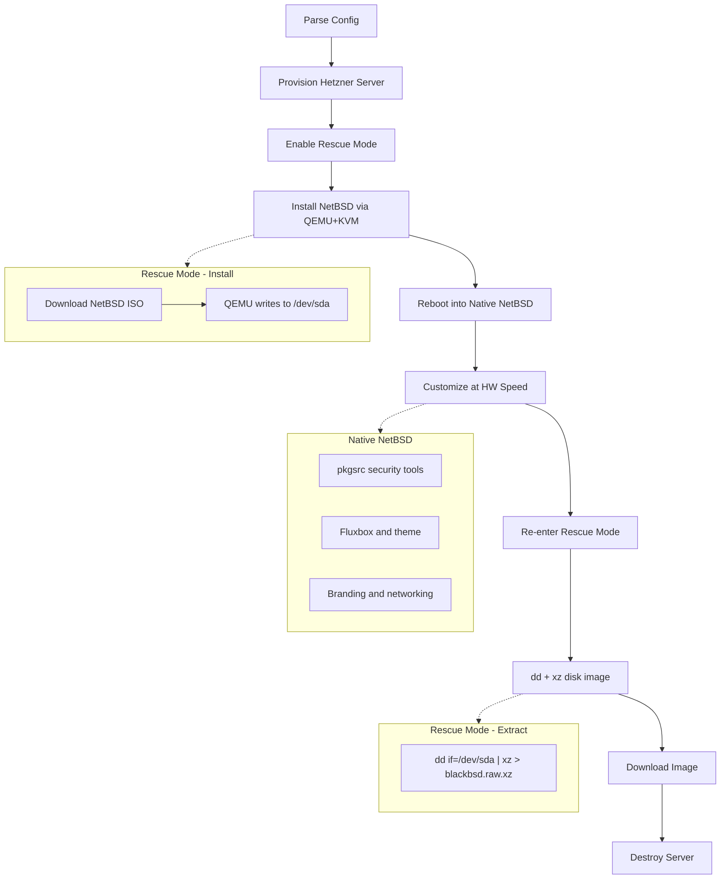

# hetzner-blackbsd

Build BlackBSD images on Hetzner Cloud. One command, one binary.

BlackBSD is a NetBSD-based LiveCD with security tools and Fluxbox. This tool automates the entire build: provision an ephemeral cloud server, use Hetzner's rescue mode to install NetBSD directly to disk, customize at native hardware speed via pkgsrc, extract the finished image, and destroy the server.

Build approach based on [HOWTO: Run NetBSD on Hetzner Cloud](https://www.unitedbsd.com/d/1262-howto-run-netbsd-on-hetzner-cloud) from the UnitedBSD community.

## Requirements

- [Go](https://go.dev/) >= 1.26
- A [Hetzner Cloud](https://www.hetzner.com/cloud) API token
- An SSH key pair

## Install

```sh
git clone https://github.com/omarluq/hetzner-blackbsd.git
cd hetzner-blackbsd
task build
```

The binary is at `bin/hetzner-blackbsd`.

Or install with `go install`:

```sh
go install github.com/omarluq/hetzner-blackbsd/cmd/hetzner-blackbsd@latest
```

## Usage

```
hetzner-blackbsd build   [--config path]  Build BlackBSD image
hetzner-blackbsd destroy [--config path]  Destroy lingering build servers
hetzner-blackbsd status  [--config path]  Show build server status
hetzner-blackbsd version                  Print version
hetzner-blackbsd help                     Print help
```

### Quick Start

1. Create a config file (`example.yml` for reference):

```yaml
hcloud_token: your_token_here  # or set HCLOUD_TOKEN env var
ssh_key_path: ~/.ssh/id_ed25519
location: fsn1
server_type: cpx31

branding:
  hostname: blackbsd
  motd: "Welcome to BlackBSD"
  default_user: security

output_iso: true
output_raw: false
build_disk_image: true
```

2. Build:

```sh
hetzner-blackbsd build --config blackbsd.yml
```

3. Artifacts land in `./output/`:
   - `blackbsd.raw.xz` — compressed disk image for cloud deployment (`xz -d | dd of=/dev/sda`)
   - `blackbsd.iso` — bootable LiveCD

## How It Works



**Key insight:** Rescue mode gives us root access to `/dev/sda` and includes QEMU+KVM. We install NetBSD via QEMU in rescue (writing directly to disk), then reboot into native NetBSD for customization. pkgsrc builds run at full hardware speed — not inside emulation.

The build server is **always destroyed** when done, even on failure. All servers are labeled `managed-by=blackbsd-builder` for easy identification. Run `hetzner-blackbsd destroy` to clean up any orphaned servers.

## Development

```sh
task deps            # download dependencies
task ci              # run all checks (fmt + lint + test + build)
task test            # run tests with race detector
task lint            # run golangci-lint
task fmt             # auto-fix with golangci-lint
task test-coverage   # generate HTML coverage report
```

### Project Structure

```
cmd/hetzner-blackbsd/    CLI entry point (Cobra commands)
internal/
├── config/              YAML config parsing & validation
├── di/                  Dependency injection (samber/do v2)
├── hcloud/              Hetzner Cloud SDK wrapper
├── logger/              Structured logging (slog + zerolog)
├── ssh/                 SSH client (x/crypto/ssh)
└── vinfo/               Build-time version info
```

### Git Hooks

```sh
lefthook install    # set up pre-commit, pre-push, commit-msg hooks
```

Pre-commit runs golangci-lint and short tests. Pre-push runs full test suite with race detector. Commit messages must follow [Conventional Commits](https://www.conventionalcommits.org/).

## Cost

A build on cpx31 (4 vCPU, 8 GB RAM) takes ~20–40 minutes. At Hetzner hourly pricing, each build costs roughly **0.01–0.03 EUR**.

## License

[BSD 3-Clause](LICENSE.md) — Copyright 2026 Omar Alani
