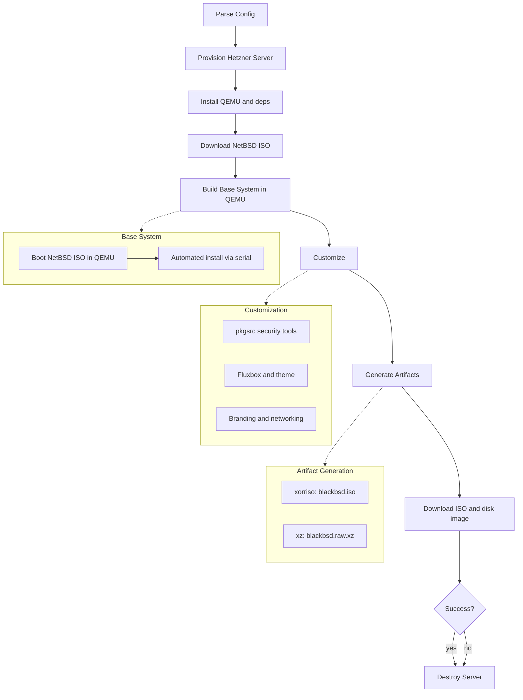

# hetzner-blackbsd

Build BlackBSD ISOs on Hetzner Cloud. One command, one binary.

BlackBSD is a NetBSD-based LiveCD with security tools and Fluxbox. This tool automates the entire build: provision an ephemeral cloud server, install NetBSD inside QEMU, layer security tools via pkgsrc, produce a bootable ISO and disk image, download artifacts, destroy the server.

Inspired by [vitobotta/hetzner-k3s](https://github.com/vitobotta/hetzner-k3s) — same pattern: Crystal + Hetzner API + SSH.

## Requirements

- [Crystal](https://crystal-lang.org/) >= 1.18.2
- [libssh2](https://www.libssh2.org/) (for SSH connectivity)
- A [Hetzner Cloud](https://www.hetzner.com/cloud) API token
- An SSH key pair

## Install

```sh
git clone https://github.com/omarluq/hetzner-blackbsd.git
cd hetzner-blackbsd
shards install
shards build hetzner-blackbsd --release
```

The binary is at `bin/hetzner-blackbsd`.

## Usage

```
hetzner-blackbsd build   [--config path]  Build BlackBSD ISO
hetzner-blackbsd destroy [--config path]  Destroy lingering build servers
hetzner-blackbsd status  [--config path]  Show build server status
hetzner-blackbsd version                  Print version
hetzner-blackbsd help                     Print help
```

### Quick Start

1. Create a config file (`blackbsd.yml`):

```yaml
hcloud_token: your_token_here  # or set HCLOUD_TOKEN env var
ssh_key_path: ~/.ssh/id_ed25519
location: fsn1
server_type: cpx31

netbsd_version: "10.1"

security_tools:
  - nmap
  - wireshark
  - metasploit
  - aircrack-ng
  - snort
  - hydra
  - john
  - tcpdump
  - netcat
  - socat

branding:
  hostname: blackbsd
  motd: "Welcome to BlackBSD"
  default_user: hacker

output_dir: ./output
```

2. Build:

```sh
hetzner-blackbsd build --config blackbsd.yml
```

3. Artifacts land in `./output/`:
   - `blackbsd.iso` — bootable LiveCD
   - `blackbsd.raw.xz` — compressed disk image for cloud deployment

## How It Works



The build server is **always destroyed** when done, even on failure. All servers are labeled `managed-by=blackbsd-builder` for easy identification. Run `hetzner-blackbsd destroy` to clean up any orphaned servers.

## Development

```sh
shards install          # install dependencies
make                    # run all checks (format + lint + test)
make format             # auto-format
make ameba              # lint
```

## Cost

A build on cpx31 (4 vCPU, 8 GB RAM) takes ~15–30 minutes. At Hetzner hourly pricing, each build costs roughly **0.01–0.03 EUR**.

## License

[BSD 3-Clause](LICENSE.md) — Copyright 2026 Omar Alani
